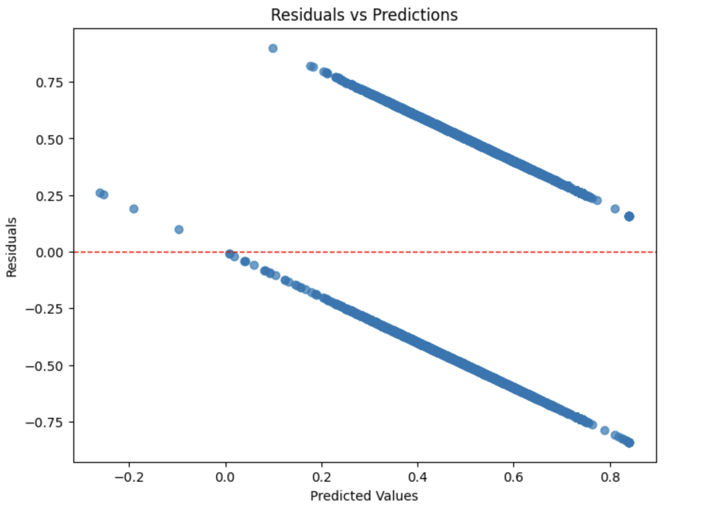
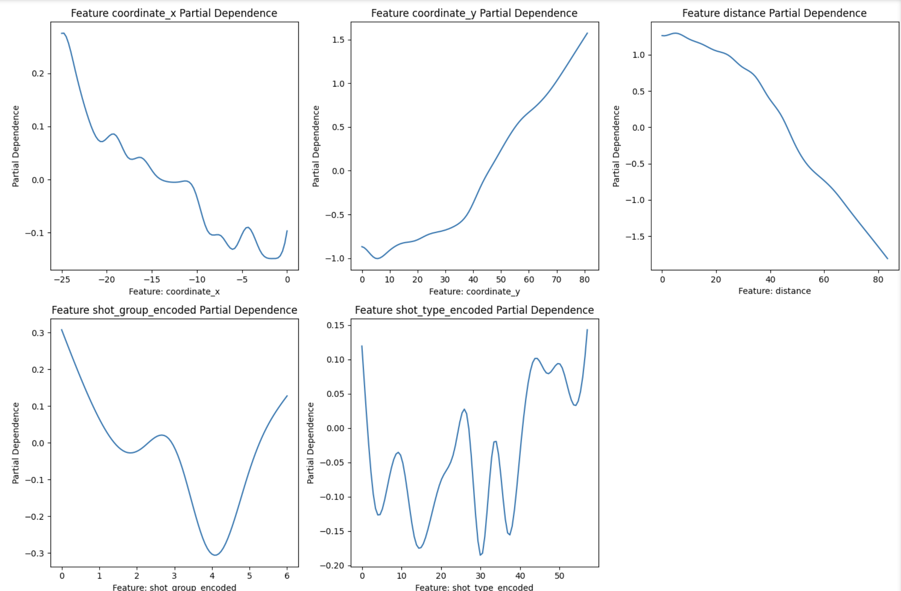
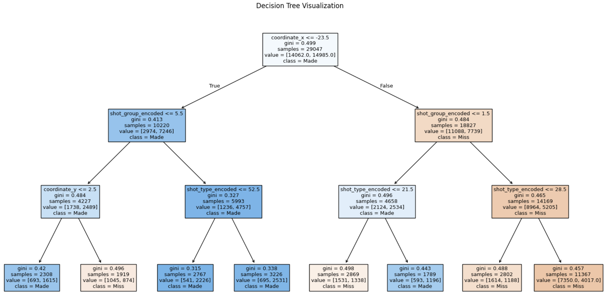
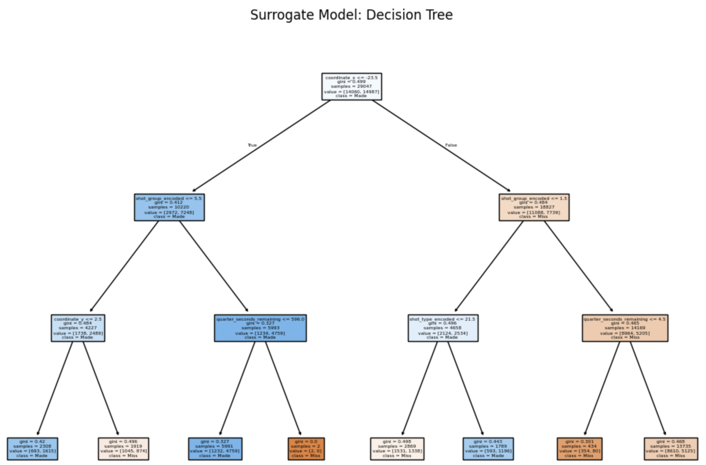
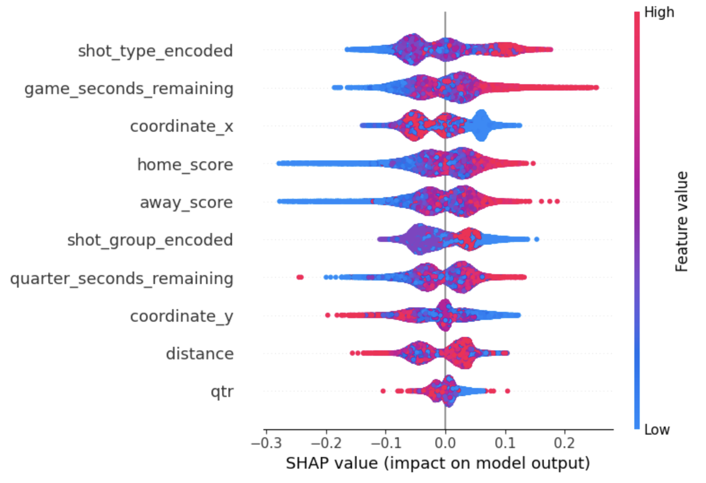

# XAI Techniques on Women's NBA Shots Dataset

This repository explores **Explainable Artificial Intelligence (XAI)** techniques in a supervised learning context. The dataset used is the [Women's NBA Shots Dataset](https://data.scorenetwork.org/basketball/wnba-shots.html), and the objective is to classify whether a basketball shot is successful ('in') or not ('out') based on several attributes.
<br>
<br>

## Table of Contents
1. [Repository Structure](#repository-structure)
2. [Exploratory Data Analysis (EDA) and Preprocessing](#exploratory-data-analysis-eda-and-preprocessing)
3. [Pre-Modeling XAI](#pre-modeling-xai)
4. [In-Modeling (Glass-Box Models)](#in-modeling-glass-box-models)
5. [Post-Modeling (Black-Box Models)](#post-modeling-black-box-models)
6. [Key Findings](#key-findings)
7. [How to Use](#how-to-use)
8. [References](#references)


## Repository Structure

```
├── wnba-shots-2021.csv             # Original dataset
├── wnba_clean.csv                  # Cleaned and preprocessed dataset
├── PreModelingXAI.ipynb            # Pre-modeling XAI
├── eda_preproc.ipynb               # EDA and preprocessing
├── glass_box_models/
│   ├── DecisionTreeXAI.ipynb
│   ├── LinearModelsXAI.ipynb
├── black_box_models/
│   ├── RandomForestXAI.ipynb
│   ├── NeuralNetworkXAI.ipynb
```
<br>
<br>

## Exploratory Data Analysis (EDA) and Preprocessing

The **Women's NBA Shots Dataset** provides rich information about shot outcomes, locations, and types. The exploratory data analysis (EDA) revealed several key insights:

- **Key Attributes**:
  - Shot coordinates (`x`, `y`) and their importance in spatial analysis.
  - Shot types and their success rates, showing class imbalance dominated by jump shots.
  - Strong correlations between shot success and features like distance to the hoop and shot type.

- **Visualizations**:
  | Shot location heatmap | Shot group imbalance |
  |:-------------:|:-----------:|
  |  |  |
<br>

For **Preprocessing**, the following steps were made:

1. **Irrelevant Feature Removal**:
   - Dropped attributes like `game_id`, `game_play_number`, `shooting_team`, `home_team_name`, and `away_team_name`, as they did not contribute to predictive or interpretative modeling.

2. **Feature Engineering**:
   - Created a new **distance attribute**, calculated as the Euclidean distance from the shot location to the hoop.
   - Grouped similar shot types into broader categories (e.g., "Jump Shot," "Layup").
   - Encoded non-numerical features (e.g., `shot type`, `shot group`) using Label Encoding, preserving ordinal relationships where applicable.

These modifications resulted in a cleaned and enhanced dataset, saved as `wnba_clean.csv`, which serves as the foundation for subsequent modeling and analysis.
<br>
<br>

## Pre-Modeling XAI

### Feature Importance

- **Mutual Information (MI):**

  MI was used to quantify the dependency between each feature and the target variable (shot success).
  Top features ranked by MI included:
    - **Distance**: Highest score, indicating a strong relationship with shot success.
    - **Shot Type (Encoded)**: Highlighted the importance of different shot categories.
    - **Coordinate Y**: Demonstrated the spatial impact on scoring likelihood.
  - Results confirmed that distance and shot type were key predictors.

- **ANOVA F-Test:**
  - Performed to statistically evaluate feature relevance.
  - Standard scaling was applied to normalize feature values.
  - Significant features such as `distance` and `coordinates` exhibited high F-values (~3641.4) with p-values close to zero, supporting their predictive importance.
<br>
<br>

### Dimensionality Reduction

- **Principal Component Analysis (PCA):**
  - Reduced the dataset to two principal components for visualization.
  - Highlighted clusters but indicated challenges in separability between successful and unsuccessful shots in the reduced space.

- **t-SNE:**
  - Applied for nonlinear dimensionality reduction.
  - Revealed more distinct regions corresponding to shot success and failure.
  - Showed clearer separability than PCA, validating the relevance of selected features.
<br>

  | Mutual Information (MI) | PCA |
  |:-------------:|:-----------:|
  |  |  |

### Key Insights

- **Top Features:** Distance, shot type/group, and spatial coordinates (x, y) emerged as the most informative predictors.
- **Feature Relevance:** Both MI and ANOVA F-tests consistently identified critical features, aligning with domain knowledge of basketball analytics.
- **Cluster Patterns:** Visualizations from t-SNE provided insights into the separability of successful vs. unsuccessful shots, emphasizing feature importance for modeling.
<br>
<br>

## In-Modeling (Glass-Box Models)

Glass-box models were used to provide interpretable insights into the decision-making process:

- **Linear Regression**:
  - Performance Metrics:
    - Mean Squared Error (MSE): 0.22
    - R² Score: 0.12
  - Coefficients highlighted the importance of shot group and type, but the model struggled with non-linear patterns.
  - Residual analysis indicated systematic errors.

- **Generalized Additive Models (GAM):**
  - Enhanced interpretability by capturing non-linear relationships.
  - Partial Dependence Plots (PDPs) revealed the influence of features like distance and coordinates.

- **Decision Trees**:
  - Performance:
    - Accuracy: 67%
  - The tree structure visualized the importance of features like distance and coordinate y, providing clear decision thresholds.
<br>
<br>

| Residuals | PDP | DT Visualization |
|:-----------------------:|:---:|:-----:|
|  |  |  |

<br>

## Post-Modeling (Black-Box Models)

Black-box models were trained to maximize predictive performance and analyzed using post-hoc XAI techniques:

- **Neural Networks (NN):**
  - High accuracy achieved by leveraging complex feature interactions.

- **Random Forest (RF):**
  - Robust performance, effectively handling non-linear and interactive effects.

<br>
<br>

**Post-hoc XAI techniques applied:**

- **Simplification-Based**:
  - A surrogate Decision Tree was trained on RF predictions, providing a simplified global explanation of its behavior.
  - Agreement Rate: 0.66, highlighting approximation limitations.

- **Feature-Based**:
  - **SHAP (SHapley Additive Explanations):** Quantified global and local feature importance.
    - Distance and coordinate y were the most impactful features globally.

  - **Permutation Importance:** Identified top contributing features for model predictions.

- **Example-Based**:
  - Counterfactual explanations highlighted what changes could flip the model’s prediction for specific instances.

<br>

  | Mutual Information (MI) | PCA |
  |:-------------:|:-----------:|
  |  |  |

<br>
<br>

## Key Findings

- Glass-box models like Decision Trees offered a balance of interpretability and performance, while GAM excelled in non-linear data scenarios.
- Black-box models like RF and NN provided superior accuracy but required post-hoc techniques like SHAP for interpretability.
- Combining in-model and post-modeling approaches allowed for both transparency and high performance.
<br>
<br>

## How to Use

1. Run the `eda_preproc.ipynb` notebook to explore the dataset and preprocess it.
2. Run `PreModelingXAI.ipynb` for pre modeling insights.
2. Navigate to the `glass_box_models/` folder for interpretable model analyses.
3. Explore the `black_box_models/` folder for complex models and their post-hoc explanations.
<br>
<br>

## References

- [Women's NBA Shots Dataset](https://data.scorenetwork.org/basketball/wnba-shots.html)
- Project Report: See `TAAC_report.pdf` for detailed analyses and results.
