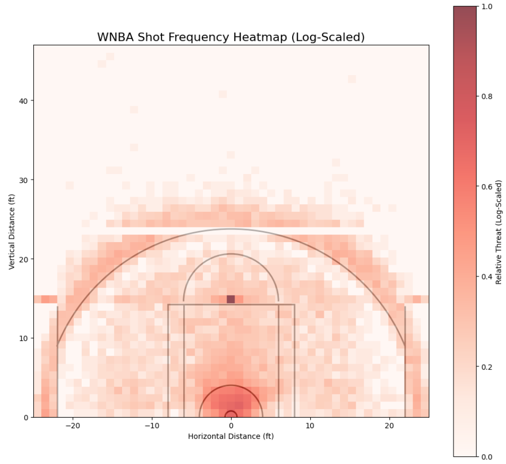
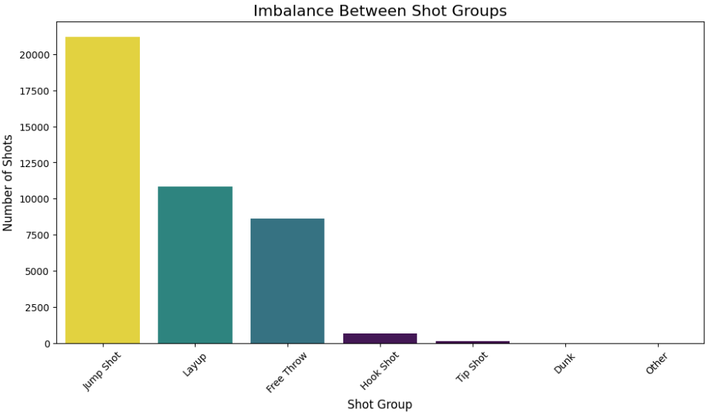
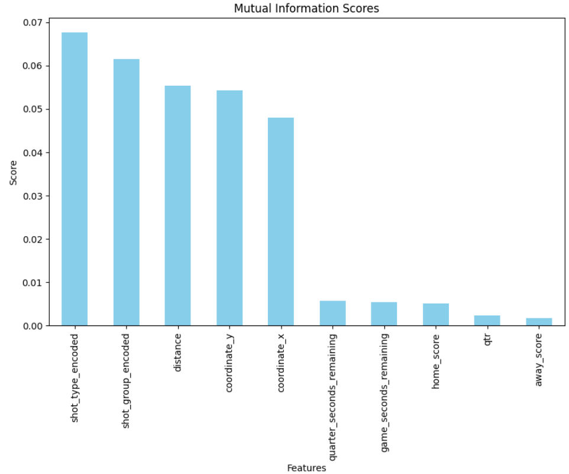
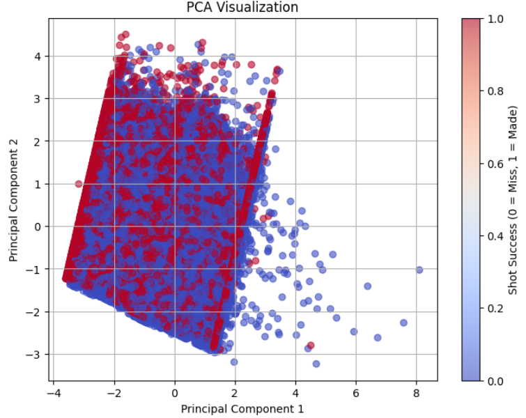

# XAI Techniques on Women's NBA Shots Dataset

This repository explores **Explainable Artificial Intelligence (XAI)** techniques in a supervised learning context. The dataset used is the [Women's NBA Shots Dataset](https://data.scorenetwork.org/basketball/wnba-shots.html), and the objective is to classify whether a basketball shot is successful ('in') or not ('out') based on several attributes.
<br>
<br>

## Table of Contents
1. [Repository Structure](#repository-structure)
2. [Exploratory Data Analysis (EDA) and Preprocessing](#exploratory-data-analysis-eda-and-preprocessing)
3. [Pre-Modeling XAI](#pre-modeling-xai)
4. [Glass-Box Models](#glass-box-models)
5. [Black-Box Models](#black-box-models)
6. [Key Findings](#key-findings)
7. [How to Use](#how-to-use)
8. [References](#references)


## Repository Structure

```
├── wnba-shots-2021.csv             # Original dataset
├── wnba_clean.csv                  # Cleaned and preprocessed dataset
├── PreModelingXAI.ipynb            # Pre-modeling XAI
├── eda_preproc.ipynb               # EDA and preprocessing
├── glass_box_models/
│   ├── DecisionTreeXAI.ipynb
│   ├── LinearModelsXAI.ipynb
├── black_box_models/
│   ├── RandomForestXAI.ipynb
│   ├── 
```
<br>
<br>

## Exploratory Data Analysis (EDA) and Preprocessing

The **Women's NBA Shots Dataset** provides rich information about shot outcomes, locations, and types. The exploratory data analysis (EDA) revealed several key insights:

- **Key Attributes**:
  - Shot coordinates (`x`, `y`) and their importance in spatial analysis.
  - Shot types and their success rates, showing class imbalance dominated by jump shots.
  - Strong correlations between shot success and features like distance to the hoop and shot type.

- **Visualizations**:
  | Shot location heatmap | Shot group imbalance |
  |:-------------:|:-----------:|
  |  |  |
<br>

For **Preprocessing**, the following steps were made:

1. **Irrelevant Feature Removal**:
   - Dropped attributes like `game_id`, `game_play_number`, `shooting_team`, `home_team_name`, and `away_team_name`, as they did not contribute to predictive or interpretative modeling.

2. **Feature Engineering**:
   - Created a new **distance attribute**, calculated as the Euclidean distance from the shot location to the hoop.
   - Grouped similar shot types into broader categories (e.g., "Jump Shot," "Layup").
   - Encoded non-numerical features (e.g., `shot type`, `shot group`) using Label Encoding, preserving ordinal distance relationships where applicable.

These modifications resulted in a cleaned and enhanced dataset, saved as `wnba_clean.csv`, which serves as the foundation for subsequent modeling and analysis.
<br>
<br>

## Pre-Modeling XAI

- **Feature Correlation**:
  - **Correlation Heatmap**: Gave interesting insights on feature relations.
- **Feature Importance**:
  - **Mutual Information (MI)**: Quantified feature relevance.
  - **ANOVA F-Test**: Confirmed statistical significance of features.
- **Dimensionality Reduction**:
  - **PCA**: Highlighted separability challenges.
  - **t-SNE**: Revealed distinct clusters for successful vs. unsuccessful shots.
<br>

  | Mutual Information (MI) | PCA |
  |:-------------:|:-----------:|
  |  |  |


**Key insights:**
- Features like shot type, distance, and spatial coordinates were the most informative.
<br>
<br>

## Glass-Box Models

Interpretable models were trained to provide insights into decision-making processes:

- **Linear Regression**:
  - Identified coefficients to understand feature importance.
  - Highlighted limitations in capturing complex relationships.

- **Generalized Additive Models (GAM)**:
  - Captured non-linear dependencies while maintaining interpretability.
  - Partial Dependence Plots (PDPs) demonstrated feature influence.

- **Decision Trees**:
  - Offered a balance between performance and interpretability.
  - Visualized decision pathways, emphasizing spatial features like distance and coordinate y.
<br>
<br>

## Black-Box Models

Black-box models were trained for higher predictive power and analyzed using post-hoc XAI techniques:

- **Neural Networks (NN)** and **Random Forest (RF)**:
  - Achieved better predictive performance but lacked intrinsic interpretability.

- **Post-Hoc XAI Techniques**:
  - **Simplification-Based**: A surrogate Decision Tree was trained on RF predictions to approximate its behavior, achieving a moderate agreement rate.
  - **Feature-Based**:
    - **SHAP**: Quantified the global and local feature importance for RF.
    - **Permutation Importance**: Highlighted the most impactful features.
  - **Example-Based**: Counterfactual explanations revealed what changes would flip a prediction.
<br>
<br>

## Key Findings

- Glass-box models provided transparency but struggled with complex patterns.
- Black-box models achieved higher accuracy, with post-hoc XAI techniques bridging the interpretability gap.
- SHAP analysis uncovered new insights, such as the influence of time pressure on shot success.
<br>
<br>

## How to Use

1. Run the `eda_preproc.ipynb` notebook to explore the dataset and preprocess it.
2. Run `PreModelingXAI.ipynb` for pre modeling insights.
2. Navigate to the `glass_box_models/` folder for interpretable model analyses.
3. Explore the `black_box_models/` folder for complex models and their post-hoc explanations.
<br>
<br>

## References

- [Women's NBA Shots Dataset](https://data.scorenetwork.org/basketball/wnba-shots.html)
- Project Report: See `TAAC_report.pdf` for detailed analyses and results.
